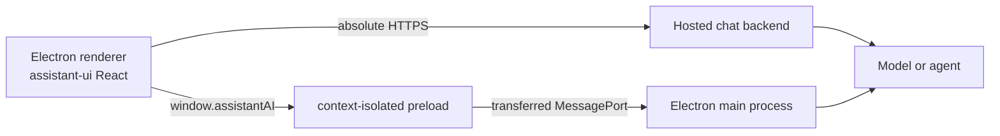

assistant-ui works in Electron through `@assistant-ui/react`. The renderer is a React DOM environment, so there is no separate `@assistant-ui/electron` package to install. The Electron-specific decision is where model requests run and how the renderer reaches them.

<Callout type="warn">
  Never put a provider API key in renderer code, a `VITE_*` variable, or a preload script. Bundled values are readable by anyone with the app. Keep remote credentials on your backend, or keep local credentials in the main process and provision them with an OS-backed secret store.
</Callout>

## Choose a connection pattern

| Pattern | Use it when | Runtime |
| --- | --- | --- |
| Hosted backend | You already have an AI SDK endpoint, need server auth or persistence, or ship the app to other people | `useChatRuntime` with an absolute HTTPS URL |
| Local main process | The desktop app owns the provider or agent process and must work without your web backend | `useLocalRuntime` with a narrow preload/IPC bridge |



Do not send an SDK client, assistant-ui runtime, callback, `AbortSignal`, or `File` through IPC. Electron IPC uses structured clone semantics; define a small data-only protocol instead.

## Pattern 1: hosted backend

This is the smallest integration. Keep your existing AI SDK chat route and point `AssistantChatTransport` at its public URL.

```tsx title="renderer/assistant-runtime.tsx"
import type { ReactNode } from "react";
import { AssistantRuntimeProvider } from "@assistant-ui/react";
import {
  AssistantChatTransport,
  useChatRuntime,
} from "@assistant-ui/react-ai-sdk";

const transport = new AssistantChatTransport({
  api: "https://api.example.com/chat",
});

export function ElectronRuntimeProvider({ children }: { children: ReactNode }) {
  const runtime = useChatRuntime({ transport });

  return (
    <AssistantRuntimeProvider runtime={runtime}>
      {children}
    </AssistantRuntimeProvider>
  );
}
```

The URL must be absolute in a packaged app. A relative value such as `/api/chat` targets the renderer's `file://` or custom-protocol origin, not your deployed backend. Configure the backend's CORS policy for the packaged origin, allow the endpoint in `connect-src`, and authenticate requests as you would from any desktop client.

The endpoint must return the AI SDK UI message stream consumed by `AssistantChatTransport`. See the [AI SDK runtime guide](/docs/runtimes/ai-sdk/v7) for the backend route and tool-calling setup.

## Pattern 2: local main process

Use this pattern when the Electron main process calls the model or runs a local agent. Keep `contextIsolation: true`, `sandbox: true`, and `nodeIntegration: false` on the `BrowserWindow`. Register `registerAssistantIpc(mainWindow)` after creating the trusted window.

The following example is intentionally text-only. It streams one request over a dedicated `MessagePort`; closing that port propagates assistant-ui's Stop action to an `AbortController` in the main process.

### 1. Define a data-only protocol

Place the shared types somewhere all three Electron bundles can import.

```ts title="shared/assistant-ipc.ts"
export const ASSISTANT_STREAM_CHANNEL = "assistant:stream";

export type ChatMessage =
  | { role: "user"; content: string }
  | { role: "assistant"; content: string };

export type ChatRequest = {
  system?: string;
  messages: ChatMessage[];
};

export type ChatEvent =
  | { type: "delta"; text: string }
  | { type: "done" }
  | { type: "error"; message: string };

export type AssistantAI = {
  streamChat(
    request: ChatRequest,
    onEvent: (event: ChatEvent) => void,
  ): () => void;
};
```

### 2. Expose one preload capability

Expose the smallest API the renderer needs, not `ipcRenderer` itself. The callback receives only validated event data, never Electron's privileged IPC event object.

```ts title="preload/assistant.ts"
import { contextBridge, ipcRenderer } from "electron";
import {
  ASSISTANT_STREAM_CHANNEL,
  type AssistantAI,
  type ChatEvent,
} from "./shared";

const assistantAI: AssistantAI = {
  streamChat(request, onEvent) {
    const { port1, port2 } = new MessageChannel();
    const onMessage = (event: MessageEvent<ChatEvent>) => onEvent(event.data);

    port1.addEventListener("message", onMessage);
    port1.start();
    ipcRenderer.postMessage(ASSISTANT_STREAM_CHANNEL, request, [port2]);

    let stopped = false;
    return () => {
      if (stopped) return;
      stopped = true;
      port1.removeEventListener("message", onMessage);
      port1.close();
    };
  },
};

contextBridge.exposeInMainWorld("assistantAI", assistantAI);
```

Declare the context-bridge API for renderer TypeScript:

```ts title="renderer/electron.d.ts"
import type { AssistantAI } from "./shared";

declare global {
  interface Window {
    assistantAI: AssistantAI;
  }
}

export {};
```

### 3. Stream from the main process

Install the provider packages in the Electron main-process bundle:

```sh
pnpm add ai @ai-sdk/openai
```

The handler checks both the sending `WebContents` and its main frame, validates the untrusted payload and bounds its size before calling the model. Set `OPENAI_API_KEY` only in the main-process environment.

```ts title="main/assistant-ipc.ts"
import { openai } from "@ai-sdk/openai";
import { streamText } from "ai";
import { ipcMain, type BrowserWindow, type IpcMainEvent } from "electron";
import {
  ASSISTANT_STREAM_CHANNEL,
  type ChatEvent,
  type ChatRequest,
} from "./shared";

const isRecord = (value: unknown): value is Record<string, unknown> =>
  typeof value === "object" && value !== null;

const isChatRequest = (value: unknown): value is ChatRequest => {
  if (!isRecord(value) || !Array.isArray(value.messages)) return false;
  if (value.system !== undefined && typeof value.system !== "string") {
    return false;
  }
  if (value.messages.length > 200) return false;

  let totalLength = typeof value.system === "string" ? value.system.length : 0;
  for (const message of value.messages) {
    if (!isRecord(message)) return false;
    if (message.role !== "user" && message.role !== "assistant") return false;
    if (typeof message.content !== "string") return false;
    totalLength += message.content.length;
    if (totalLength > 1_000_000) return false;
  }

  return true;
};

export function registerAssistantIpc(mainWindow: BrowserWindow) {
  const handleStream = (event: IpcMainEvent, request: unknown) => {
    const [port] = event.ports;
    if (!port) return;

    if (
      event.sender !== mainWindow.webContents ||
      event.senderFrame !== mainWindow.webContents.mainFrame
    ) {
      port.close();
      return;
    }

    port.start();
    if (!isChatRequest(request)) {
      port.postMessage({
        type: "error",
        message: "Invalid chat request.",
      } satisfies ChatEvent);
      port.close();
      return;
    }

    const abortController = new AbortController();
    port.once("close", () => abortController.abort());
    const send = (message: ChatEvent) => port.postMessage(message);

    void (async () => {
      try {
        const result = streamText({
          model: openai("gpt-5.4-mini"),
          messages: request.messages,
          ...(request.system ? { system: request.system } : {}),
          abortSignal: abortController.signal,
        });

        for await (const text of result.textStream) {
          send({ type: "delta", text });
        }
        send({ type: "done" });
      } catch (error) {
        if (abortController.signal.aborted) return;
        console.error("Assistant stream failed", error);
        send({ type: "error", message: "The model request failed." });
      }
    })();
  };

  ipcMain.on(ASSISTANT_STREAM_CHANNEL, handleStream);
  mainWindow.once("closed", () => {
    ipcMain.removeListener(ASSISTANT_STREAM_CHANNEL, handleStream);
  });
}
```

If your app can open more than one trusted assistant window, register a unique channel per window or route requests through one application-level registry. A global `ipcMain.on` listener should not be re-registered under the same channel for every window.

### 4. Adapt IPC to assistant-ui

`ChatModelAdapter` yields complete snapshots, so the renderer accumulates each IPC delta before yielding it. Its cleanup function closes the port on Stop, unmount, or completion.

```tsx title="renderer/assistant-runtime.tsx"
import type { ReactNode } from "react";
import {
  AssistantRuntimeProvider,
  useLocalRuntime,
  type ChatModelAdapter,
} from "@assistant-ui/react";
import type { ChatMessage } from "./shared";

const ipcChatModel: ChatModelAdapter = {
  async *run({ messages, context, abortSignal }) {
    abortSignal.throwIfAborted();

    const system = [context.system];
    const serializedMessages: ChatMessage[] = [];

    for (const message of messages) {
      const text = message.content
        .flatMap((part) => (part.type === "text" ? [part.text] : []))
        .join("\n");
      if (!text) continue;

      if (message.role === "system") system.push(text);
      if (message.role === "user") {
        serializedMessages.push({ role: "user", content: text });
      }
      if (message.role === "assistant") {
        serializedMessages.push({ role: "assistant", content: text });
      }
    }

    const systemText = system.filter(Boolean).join("\n\n");
    let stop: (() => void) | undefined;
    let removeAbortListener: (() => void) | undefined;
    const deltas = new ReadableStream<string>({
      start(controller) {
        let settled = false;
        const close = () => {
          if (settled) return;
          settled = true;
          controller.close();
        };
        const fail = (error: unknown) => {
          if (settled) return;
          settled = true;
          controller.error(error);
        };

        stop = window.assistantAI.streamChat(
          {
            ...(systemText ? { system: systemText } : {}),
            messages: serializedMessages,
          },
          (event) => {
            if (event.type === "delta") controller.enqueue(event.text);
            if (event.type === "done") close();
            if (event.type === "error") fail(new Error(event.message));
          },
        );

        const onAbort = () => {
          stop?.();
          fail(abortSignal.reason);
        };
        abortSignal.addEventListener("abort", onAbort, { once: true });
        removeAbortListener = () =>
          abortSignal.removeEventListener("abort", onAbort);
        if (abortSignal.aborted) onAbort();
      },
      cancel() {
        stop?.();
      },
    });

    const reader = deltas.getReader();
    let fullText = "";
    try {
      while (true) {
        const { done, value } = await reader.read();
        if (done) return;
        fullText += value;
        yield { content: [{ type: "text", text: fullText }] };
      }
    } finally {
      removeAbortListener?.();
      stop?.();
      reader.releaseLock();
    }
  },
};

export function ElectronRuntimeProvider({ children }: { children: ReactNode }) {
  const runtime = useLocalRuntime(ipcChatModel);
  return (
    <AssistantRuntimeProvider runtime={runtime}>
      {children}
    </AssistantRuntimeProvider>
  );
}
```

Wrap your existing assistant-ui thread with `ElectronRuntimeProvider`. Primitives and installed UI components work exactly as they do in a browser React app.

## Extend the protocol deliberately

The local example drops every non-text content part. Add explicit structured-clone-safe fields before claiming support for more features:

- Attachments: pass bounded `ArrayBuffer` data or an app-owned file reference after validating type, size, and path in the main process. Do not pass browser `File` objects.
- Tools: define serializable tool-call and tool-result events, and validate every tool invocation in the privileged process. Never expose a generic shell or filesystem IPC method.
- Reasoning and metadata: add distinct event variants and map them to the corresponding assistant-ui content parts.
- Thread persistence: store serializable thread data in the main process or use a remote thread-list adapter; do not try to transfer a runtime object.

## Packaged-app checklist

- Use an absolute HTTPS endpoint, a privileged custom protocol, or the preload bridge. Relative `/api/*` routes that worked against a development server will not follow your backend after packaging.
- Serve local content through a custom protocol instead of `file://` when possible, and define a restrictive Content Security Policy. Do not disable `webSecurity` to work around origin errors.
- Validate every IPC sender and every payload in the main process. Treat renderer data as untrusted even when the renderer is local.
- Intercept new windows and external links with `webContents.setWindowOpenHandler`; do not let model-generated links create unrestricted Electron windows.
- If you render remote HTML with `SafeContentFrame`, allow its documented host in `frame-src`. Ordinary text and Markdown rendering need no Electron-specific change.
- Test the packaged build, not only the Vite or Webpack development server. The scheme, origin, preload path, CSP, and environment loading can all differ.

For the underlying platform constraints, see Electron's official guides to [IPC and MessagePorts](https://www.electronjs.org/docs/latest/tutorial/message-ports), [context isolation](https://www.electronjs.org/docs/latest/tutorial/context-isolation), and the [security checklist](https://www.electronjs.org/docs/latest/tutorial/security).
